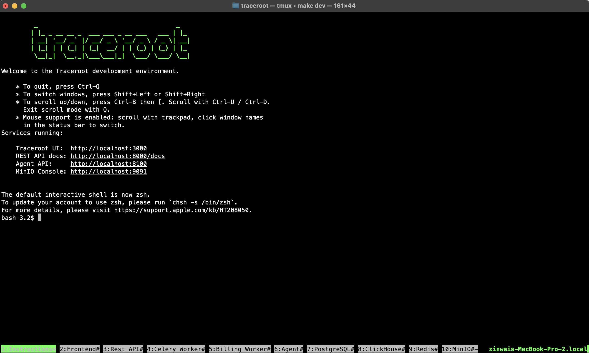

# Contributing to TraceRoot

Thanks for your interest in contributing! This guide will help you get started.

## Development Requirements

- Docker desktop app
- uv: Python package manager
- pnpm: Node.js package manager
- tmux: terminal multiplexer
- goose: ClickHouse migration tool

## Quick Start

```bash
cp .env.example .env  # First time only — then edit with your API keys
make dev              # Start development environment
```

## Development Commands

| Command | Description |
|---------|-------------|
| `make dev` | Start dev environment. Idempotent — reattaches to existing tmux session if running. |
| `make dev-autoreload` | Same as `make dev`, but services auto-restart on code changes. |
| `make dev-reset` | Nuclear reset: kills tmux, destroys containers/volumes/node_modules. Run `make dev` after. |

All commands handle deps, Docker containers, migrations, and launch services in tmux (one window per service).

<div align="center">
  <kbd></kbd>
</div>

## License

This project is licensed under [Apache 2.0](LICENSE) with additional [Enterprise features](./ee/LICENSE).

When contributing to the TraceRoot codebase, you need to agree to the [Contributor License Agreement](https://cla-assistant.io/traceroot-ai/traceroot). You only need to do this once.
