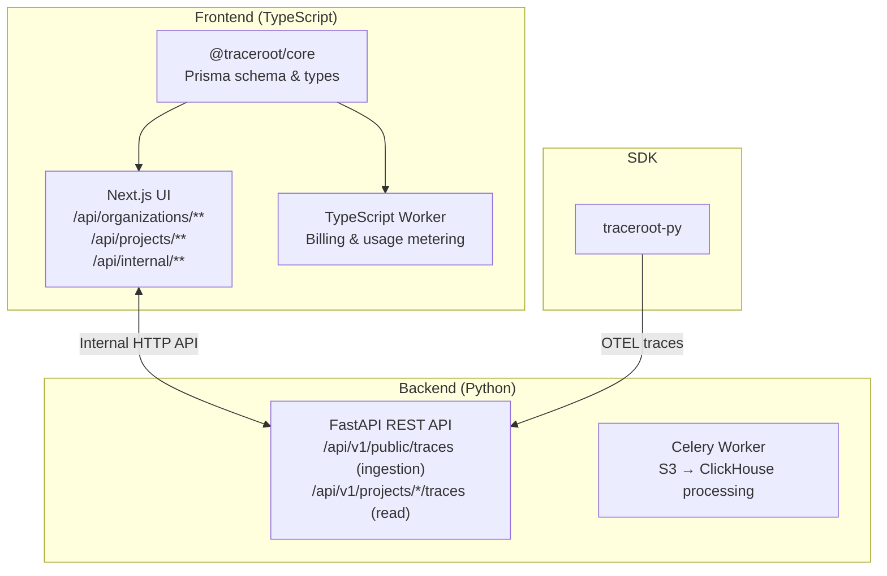

# Contributing to TraceRoot

Thanks for your interest in contributing! This guide will help you get started.

## Prerequisites

- [Docker](https://docs.docker.com/get-docker/)
- [uv](https://docs.astral.sh/uv/) — Python package manager
- [pnpm](https://pnpm.io/) — Node.js package manager
- [goose](https://github.com/pressly/goose) — ClickHouse migrations (`brew install goose`)
- [tmux](https://github.com/tmux/tmux) — Terminal multiplexer (`brew install tmux`)

## Quick Start

```bash
git clone https://github.com/traceroot-ai/traceroot.git
cd traceroot
make dev
```

That's it. `make dev` handles everything:
- Creates `.env` from `.env.example`
- Starts Docker infrastructure (PostgreSQL, ClickHouse, MinIO, Redis)
- Installs dependencies
- Runs migrations
- Launches all services in tmux

## Project Structure

```
traceroot/
├── frontend/                 # TypeScript monorepo (pnpm workspace)
│   ├── packages/core/        # @traceroot/core - Prisma schema & types
│   ├── ui/                   # Next.js application
│   └── worker/               # Background jobs (billing)
├── backend/                  # Python services (uv workspace)
│   ├── rest/                 # FastAPI - trace ingestion & API
│   ├── worker/               # Celery - trace processing
│   └── db/                   # ClickHouse client & migrations
└── traceroot-py/             # Python SDK
```

## Architecture



### Internal API

The Python backend communicates with Next.js via internal HTTP endpoints:

| Endpoint | Purpose |
|----------|---------|
| `POST /api/internal/validate-api-key` | Validate API key for trace ingestion |
| `POST /api/internal/validate-project-access` | Validate user access for trace reading |

These require the `X-Internal-Secret` header matching `INTERNAL_API_SECRET`.

## Development

### Tmux Navigation

| Key | Action |
|-----|--------|
| `Shift+Right/Left` | Switch windows |
| `Ctrl+Q` | Kill session |
| Mouse scroll | View log history |

### Services

| Window | Service | URL |
|--------|---------|-----|
| 1 | Instructions | — |
| 2 | REST API | http://localhost:8000/docs |
| 3 | Celery Worker | — |
| 4 | Frontend | http://localhost:3000 |
| 5 | Billing Worker | — |
| 6 | Infra Logs | — |

### Useful Commands

```bash
# Development
make dev              # Start everything
make dev-autoreload   # With Python auto-reload
make dev-reset        # Nuclear reset

# Testing
uv run pytest                        # Python tests
cd traceroot-py && uv run pytest     # SDK tests
cd frontend/ui && pnpm test          # Frontend tests

# Linting (auto-runs on commit via pre-commit)
uv run ruff check .          # Python
cd frontend/ui && pnpm lint  # TypeScript
```

### Environment

All services read from a **single `.env` file** at the project root. See `.env.example` for options.

Key variables:

| Variable | Description |
|----------|-------------|
| `DATABASE_URL` | PostgreSQL connection |
| `CLICKHOUSE_HOST` | ClickHouse host |
| `S3_ENDPOINT_URL` | MinIO/S3 endpoint |
| `ENABLE_BILLING` | Set `false` for self-hosted (unlocks all features) |

## Database Development

### Schema Strategy

- **PostgreSQL**: Prisma is the source of truth (in `frontend/packages/core/`)
- **ClickHouse**: goose migrations (in `backend/db/clickhouse/migrations/`)

### Migrations

**PostgreSQL:**
```bash
cd frontend/packages/core
pnpm db:generate  # Regenerate Prisma client
pnpm db:migrate   # Create & apply migration
```

**ClickHouse:**
```bash
cd backend/db/clickhouse
./migrate.sh up      # Apply migrations
./migrate.sh status  # Check status
./migrate.sh create add_new_column  # New migration
```

### Inspecting Databases

```bash
# PostgreSQL
docker exec -it traceroot-postgres-1 psql -U postgres -d postgres

# ClickHouse
docker exec -it traceroot-clickhouse-1 clickhouse-client --user clickhouse --password clickhouse

# MinIO
open http://localhost:9001  # user: minio, pass: minio
```

## Making Changes

### Before You Start

1. **Open an issue** first for significant changes
2. Check existing [issues](https://github.com/traceroot-ai/traceroot/issues)
3. Fork and create a feature branch

### Code Style

We use [pre-commit](https://pre-commit.com/) — set it up once:

```bash
pre-commit install
```

Every commit automatically runs:
- **Python**: `ruff` (lint + format)
- **TypeScript**: `eslint --fix` + `prettier`

### Commit Messages

Follow [conventional commits](https://www.conventionalcommits.org/):

```
feat: add trace filtering API
fix: resolve race condition in worker
docs: update SDK documentation
```

### Pull Requests

1. Ensure tests pass
2. Update docs if needed
3. Add tests for new features
4. Keep PRs focused

## Troubleshooting

**Port in use:**
```bash
lsof -i :8000 && kill -9 <PID>
```

**Database issues:**
```bash
docker compose ps           # Check containers
docker compose logs postgres  # View logs
```

**Dependencies broken:**
```bash
make dev-reset  # Nuclear option
```

## License

Apache-2.0. You'll need to sign the [CLA](https://cla-assistant.io/traceroot-ai/traceroot) for contributions.
