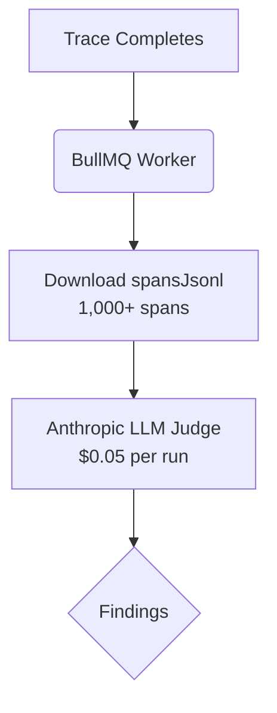
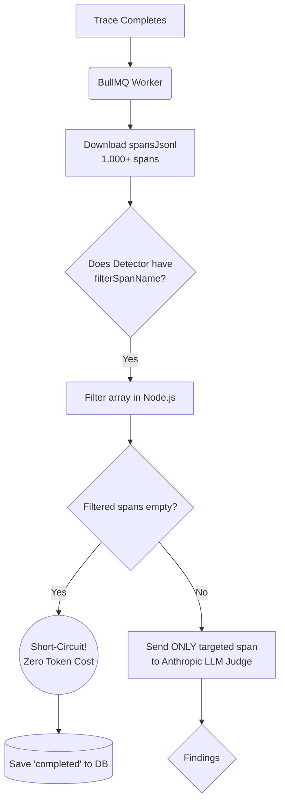

## Background
Currently, Detectors in TraceRoot execute on the **entire trace** (`spansJsonl` payload). For high-volume projects with massive traces, this causes two significant issues:
1. **Safety Truncation**: Traces hitting the `150,000` character limit are aggressively truncated, blinding the LLM judge to potentially critical spans at the end of the trace.
2. **Cost & Latency Inefficiency**: The BullMQ worker blindly sends thousands of irrelevant SQL queries and HTTP spans to the LLM judge, burning tokens and context-window attention just to evaluate a single rule (e.g. `ActionExecutor.run_terminal_command`).

## Proposed Architecture (Span-Level Filtering)
This PR introduces **Span-Level Filtering** at the BullMQ worker level. Detectors can now specify a `filterSpanName` target.

### Before this PR 🔴

### After this PR 🟢

## Changes
- **Prisma Schema**: Added `filter_span_name` to the `Detector` table.
- **Detector API**: `POST /api/projects/[projectId]/detectors` now accepts and stores the `filterSpanName`.
- **Worker Bypass**: The BullMQ processor intercepts the payload in `evaluateTrace`. It drops non-matching spans, and completely aborts the LLM API call if the resulting array is empty, silently logging a successful completion to the database.

## Impact
- **Cost**: Reduces token usage by ~95% for targeted detectors.
- **Accuracy**: Eliminates "lost in the middle" context issues by cleaning up the prompt.
- **Reliability**: Evades the 150k trace truncation limit entirely for targeted detectors.
