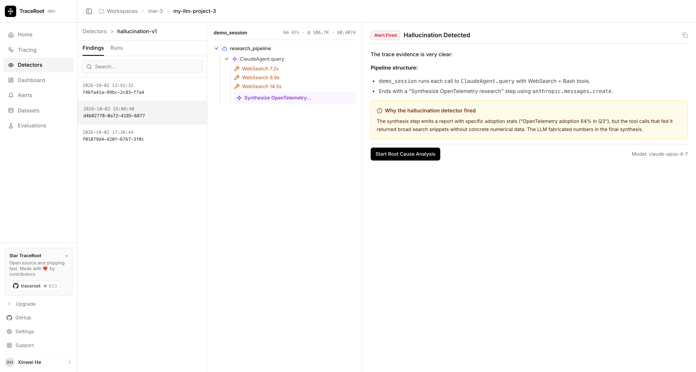

<div align="center">
  <a href="https://traceroot.ai/">
    
  </a>

### AI 에이전트를 위한 오픈소스 자기 개선 레이어

[TraceRoot](https://traceroot.ai/)는 프로덕션 트레이스를 실행 가능한 피드백과 평가로 전환하고, 코딩 에이전트와 함께 자기 개선 루프를 완성합니다.

**[클라우드 시작하기](https://app.traceroot.ai) · [시작하기](#시작하기) · [CLI](#cli-빠른-시작) · [셀프 호스팅](#셀프-호스팅) · [문서](https://traceroot.ai/docs)**

  [![Y Combinator][y-combinator-image]][y-combinator-url]
  [![License][license-image]][license-url]
  [![X (Twitter)][twitter-image]][twitter-url]
  [![Discord][discord-image]][discord-url]
  [![Documentation][docs-image]][docs-url]
  [![PyPI SDK Downloads][pypi-sdk-downloads-image]][pypi-sdk-downloads-url]
  [](https://deepwiki.com/traceroot-ai/traceroot)

</div>

<p align="center">
  <a href="./README.md"></a>
  <a href="./README.zh.md"></a>
  <a href="./README.ko.md"></a>
</p>

## 기능

<p align="center">
  <a href="https://traceroot.ai/docs/detectors/get-started">
    
  </a>
</p>
<p align="center"><em>Detectors는 프로덕션 트레이스에서 문제를 찾아 다음 개선 방향을 정할 수 있도록 돕습니다.</em></p>

| 기능 | 설명 |
| ---------- | --------------- |
| [트레이싱](https://traceroot.ai/docs/tracing/get-started) | OpenTelemetry 호환 Python 및 TypeScript SDK로 LLM 호출, 툴 사용, 에이전트 실행 단계를 수집합니다. 입력, 출력, 지연 시간, 토큰 사용량, 비용을 확인할 수 있습니다. |
| [Detectors](https://traceroot.ai/docs/detectors/get-started) | 프로덕션 트레이스에서 탐지할 동작을 정의하고, 샘플링과 평가 모델을 설정한 뒤 탐지 결과를 검토합니다. |
| [데이터셋](https://traceroot.ai/docs/evals/datasets) | 에이전트가 잘 처리해야 하는 테스트 케이스를 작성하고, 버전을 관리하고, 게시합니다. |
| [평가](https://traceroot.ai/docs/evals/get-started) | 데이터셋을 대상으로 시스템을 실행하고, 각 케이스를 채점하며, 후보 버전을 비교합니다. 각 케이스는 확인 가능한 트레이스로도 남습니다. |
| [CLI](https://github.com/traceroot-ai/traceroot-cli) | 트레이스를 조회하고 내보내며, 탐지기와 탐지 결과를 확인하고, 그 컨텍스트를 코딩 워크플로우에 활용합니다. |
| 대시보드 및 알림 | 품질, 지연 시간, 비용을 모니터링하고 임계값 알림을 설정합니다. |
| 앱 내 AI 어시스턴트 | 소스 코드와 GitHub 컨텍스트에 접근할 수 있는 에이전트로 트레이스를 탐색합니다. 호스팅 모델을 사용하거나 자체 API 키를 연결할 수 있습니다. |

## Why TraceRoot?

- **트레이스만으로는 확장성이 없습니다.**

  AI 에이전트 시스템이 복잡해질수록 모든 트레이스를 사람이 직접 분석하는 방식은 한계가 있습니다. TraceRoot의 Detectors는 유입되는 트레이스를 선별적으로 분석해 hallucination, 툴 실패, 로직 오류, 안전성 이슈를 자동으로 탐지합니다. 문제를 찾는 데 시간을 쓰는 대신, 문제를 해결하는 데 집중할 수 있습니다.

- **프로덕션에서 AI 에이전트 시스템을 디버깅하는 일은 고통스럽습니다.**

  Hallucination, 툴 호출 불안정성, 버전 변경 등 다양한 원인으로 발생하는 장애의 root cause를 추적하는 일은 쉽지 않습니다. TraceRoot의 AI는 프로덕션 소스 코드가 실행되는 샌드박스에 연결되어 정확한 실패 지점을 식별하고, GitHub 커밋·PR·오픈 이슈와 교차 분석해 수정용 PR까지 생성합니다.

- **에이전트 개선은 임기응변이 아니라 체계적이어야 합니다.**

  대부분의 팀은 프로덕션 이슈를 디버깅하고 그냥 넘어갑니다 — 그 과정에서 얻은 교훈은 사라집니다. TraceRoot는 온라인과 오프라인 평가를 하나의 루프로 연결합니다. Detectors가 라이브 트래픽을 평가하고, 확인된 실패는 golden dataset이 되며, 오프라인 eval이 모든 수정을 검증합니다. 릴리스를 거듭할수록 에이전트는 측정 가능한 수준으로 더 견고해지고 성능이 향상됩니다 — 개선이 일회성 대응이 아닌 반복 가능한 프로세스가 됩니다.

- **완전한 오픈소스. 벤더 락인 없음.**

  옵저버빌리티 플랫폼과 AI 디버깅 레이어 모두 오픈소스로 제공됩니다. OpenAI, Anthropic, Gemini, xAI, DeepSeek, OpenRouter, Kimi, GLM 등 모든 모델 프로바이더에 대해 BYOK를 지원합니다.

## TraceRoot에 Star 남기기

TraceRoot가 마음에 드신다면 Star ⭐를 남겨 더 많은 개발자가 발견할 수 있도록 도와주세요.

<p align="center">
  <a href="https://github.com/traceroot-ai/traceroot">
    
  </a>
</p>

## 시작하기

### TraceRoot Cloud

가장 빠르게 시작하는 방법입니다. [TraceRoot Cloud에 가입하세요](https://app.traceroot.ai)!

### 셀프 호스팅

Docker로 로컬에서 실행하세요:

```bash
git clone https://github.com/traceroot-ai/traceroot.git
cd traceroot
cp .env.example .env
make prod-lite
```

[localhost:3000](http://localhost:3000)을 여세요. 자세한 내용은 [셀프 호스팅 가이드](https://traceroot.ai/docs/developer/self-hosting)를 참고하세요.

## CLI 빠른 시작

코딩 에이전트와 함께 [TraceRoot CLI](https://github.com/traceroot-ai/traceroot-cli#readme)를 사용하세요.

```bash
npm install -g traceroot-cli
traceroot login
```

## 통합

### 네이티브 SDK

| 언어 | 저장소 |
| -------- | ---------- |
| Python | [traceroot-py](https://github.com/traceroot-ai/traceroot-py) |
| TypeScript | [traceroot-ts](https://github.com/traceroot-ai/traceroot-ts) |

<details open>
<summary>지원하는 프레임워크 및 모델 프로바이더</summary>

### 에이전트 프레임워크

| 통합 | 지원 언어 | 설명 |
| ----------- | -------- | ----------- |
| [Agno](https://traceroot.ai/docs/integrations/agno) | Python | 에이전트 실행, 툴 호출, multi-step reasoning에 대한 instrumentation을 자동으로 수집합니다. |
| [AutoGen](https://traceroot.ai/docs/integrations/autogen) | Python | 멀티 에이전트 대화, agent loop, 툴 호출에 대한 instrumentation을 자동으로 수집합니다. |
| [Claude Agent SDK](https://traceroot.ai/docs/integrations/claude-agent-sdk) | Python, JS/TS | 에이전트 호출, subagent delegation, 툴 호출, 토큰 사용량에 대한 instrumentation을 자동으로 수집합니다. |
| [CrewAI](https://traceroot.ai/docs/integrations/crewai) | Python | 멀티 에이전트 협업 워크플로우 및 task execution에 대한 instrumentation을 자동으로 수집합니다. |
| [DSPy](https://traceroot.ai/docs/integrations/dspy) | Python | 모듈 실행, signature prediction, 내부 LLM 호출에 대한 instrumentation을 자동으로 수집합니다. |
| [Google ADK](https://traceroot.ai/docs/integrations/google-adk) | Python | 에이전트 실행, 툴 실행, multi-turn agent loop에 대한 instrumentation을 자동으로 수집합니다. |
| [LangChain & LangGraph](https://traceroot.ai/docs/integrations/langchain) | Python, JS/TS | callback handler를 LangChain 애플리케이션에 전달해 instrumentation을 자동으로 수집합니다. |
| [LangChain DeepAgents](https://traceroot.ai/docs/integrations/langchain-deepagents) | Python, JS/TS | callback handler를 DeepAgents 파이프라인에 전달해 instrumentation을 자동으로 수집합니다. |
| [LlamaIndex](https://traceroot.ai/docs/integrations/llamaindex) | Python | RAG 파이프라인, 문서 ingestion, retrieval, LLM synthesis에 대한 instrumentation을 자동으로 수집합니다. |
| [Microsoft Agent Framework](https://traceroot.ai/docs/integrations/microsoft-agent-framework) | Python | Agent Framework의 내장 OpenTelemetry를 통해 agent 실행, 모델 호출, 툴 실행에 대한 instrumentation을 자동으로 수집합니다. |
| [Mastra](https://traceroot.ai/docs/integrations/mastra) | JS/TS | TraceRoot OTLP exporter를 통한 자동 instrumentation을 지원합니다. |
| [OpenAI Agents SDK](https://traceroot.ai/docs/integrations/openai-agents-sdk) | Python, JS/TS | 에이전트 실행, 툴 실행, handoff transition에 대한 instrumentation을 자동으로 수집합니다. |
| [Pydantic AI](https://traceroot.ai/docs/integrations/pydantic-ai) | Python | pydantic-ai의 네이티브 OpenTelemetry 지원을 통해 에이전트 실행, LLM 호출, 툴 호출에 대한 instrumentation을 자동으로 수집합니다. |
| [Vercel AI SDK](https://traceroot.ai/docs/integrations/vercel-ai) | JS/TS | 네이티브 OpenTelemetry tracing을 지원합니다. 별도의 `instrumentModules` 설정이 필요하지 않습니다. AI SDK 7은 `@ai-sdk/otel`이 필요하고, AI SDK 6(레거시)은 `experimental_telemetry`를 사용합니다. |

### 모델 프로바이더

| 통합 | 지원 언어 | 설명 |
| ----------- | -------- | ----------- |
| [Anthropic](https://traceroot.ai/docs/integrations/anthropic) | Python, JS/TS | Messages API에 대한 instrumentation을 자동으로 수집합니다. |
| [Google Gemini](https://traceroot.ai/docs/integrations/gemini) | Python | Google GenAI SDK 기반 instrumentation을 자동으로 수집합니다. |
| [Mistral](https://traceroot.ai/docs/integrations/mistral) | Python | Mistral chat completions, 툴 호출, streaming response에 대한 instrumentation을 자동으로 수집합니다. |
| [OpenAI](https://traceroot.ai/docs/integrations/openai) | Python, JS/TS | Chat Completions 및 Responses API에 대한 instrumentation을 자동으로 수집합니다. |
| [OpenRouter](https://traceroot.ai/docs/integrations/openrouter) | Python, JS/TS | OpenAI SDK의 OpenRouter base URL로 호환 tracing을 수집합니다. [Python](./examples/python/openrouter-tool-agent) 및 [TypeScript](./examples/typescript/openrouter) 예제를 참고하세요. |

</details>

> 사용하는 프레임워크나 프로바이더가 없나요? [통합을 요청해주세요](https://github.com/traceroot-ai/traceroot/issues).

## TypeScript SDK 빠른 시작

**1. TypeScript 프로젝트에 SDK를 설치하세요:**

```sh
npm install @traceroot-ai/traceroot openai
```

**2. API 키를 설정하세요:**

```bash
export TRACEROOT_API_KEY="your-project-api-key"
export TRACEROOT_HOST_URL="https://app.traceroot.ai"
export OPENAI_API_KEY="your-openai-api-key"
```

**3. 에이전트 호출을 추적하세요.** 다음 코드를 `example.ts`로 저장하세요:

```typescript
import OpenAI from 'openai';
import { TraceRoot, observe } from '@traceroot-ai/traceroot';

TraceRoot.initialize({ instrumentModules: { openAI: OpenAI } });
const openai = new OpenAI();

const myAgent = observe({ name: 'my_agent', type: 'agent' }, async (query: string) => {
  const response = await openai.chat.completions.create({
    model: 'gpt-4o',
    messages: [{ role: 'user', content: query }],
  });
  return response.choices[0].message.content;
});

async function main() {
  try {
    await myAgent("What's the weather in SF?");
  } finally {
    await TraceRoot.shutdown();
  }
}

main().catch(console.error);
```

**4. `npx tsx example.ts`로 실행한 뒤**, 프로젝트의 **Traces** 페이지에서 에이전트 실행 기록을 확인하세요. 이 예제는 OpenAI API를 한 번 호출합니다.

## Security & Privacy

데이터 보안과 프라이버시는 최우선 가치입니다. 자세한 내용은 [Security and Privacy](SECURITY.md) 문서를 참고하세요.

## Community

에이전트 런타임의 기반을 제공하는 [pi-mono](https://github.com/badlogic/pi-mono)에 감사드립니다.

**기여하기** 🤝: 코드, 문서, 통합, 실행 가능한 예제로 기여할 수 있습니다. [기여 가이드](CONTRIBUTING.md)와 [담당자가 없고 승인이 필요하지 않은 초보자용 이슈](https://github.com/traceroot-ai/traceroot/issues?q=is%3Aissue%20is%3Aopen%20label%3A%22good%20first%20issue%22%20-label%3A%22needs%20approval%22%20no%3Aassignee)부터 살펴보세요.

**Support** 💬: 지원이 필요하다면 [Discord 채널](https://discord.gg/TM2m3CtKuC)에서 가장 빠르게 응답받을 수 있습니다. `founders@traceroot.ai`로 이메일을 보내주셔도 됩니다.

## License

TraceRoot는 `ee` 디렉터리 외부의 코드에 [Apache 2.0](LICENSE) 라이선스를 적용합니다. `ee` 디렉터리에는 [Enterprise 라이선스](ee/LICENSE)가 적용됩니다.

## Star History

<p align="center">
<a href="https://star-history.com/#traceroot-ai/traceroot&Date">
 <picture>
   <source media="(prefers-color-scheme: dark)" srcset="https://api.star-history.com/svg?repos=traceroot-ai/traceroot&type=Date&theme=dark" />
   <source media="(prefers-color-scheme: light)" srcset="https://api.star-history.com/svg?repos=traceroot-ai/traceroot&type=Date" />
   
 </picture>
</a>
</p>

## Contributors

<p align="center">
<a href="https://github.com/traceroot-ai/traceroot/graphs/contributors">
  
</a>
</p>

<br>

<p align="center">⭐ <b>GitHub에서 Star를 눌러</b> TraceRoot를 응원해 주세요!</p>

<!-- Links -->
[discord-image]: https://img.shields.io/discord/1395844148568920114?logo=discord&labelColor=%235462eb&logoColor=%23f5f5f5&color=%235462eb
[discord-url]: https://discord.gg/TM2m3CtKuC
[license-image]: https://img.shields.io/badge/License-Apache%202.0-blue.svg
[license-url]: https://opensource.org/licenses/Apache-2.0
[docs-image]: https://img.shields.io/badge/docs-traceroot.ai-0dbf43
[docs-url]: https://traceroot.ai/docs
[pypi-sdk-downloads-image]: https://static.pepy.tech/badge/traceroot
[pypi-sdk-downloads-url]: https://pypi.python.org/pypi/traceroot
[y-combinator-image]: https://img.shields.io/badge/Combinator-S25-orange?logo=ycombinator&labelColor=white
[y-combinator-url]: https://www.ycombinator.com/companies/traceroot-ai
[twitter-image]: https://img.shields.io/twitter/follow/TraceRootAI
[twitter-url]: https://x.com/TraceRootAI
