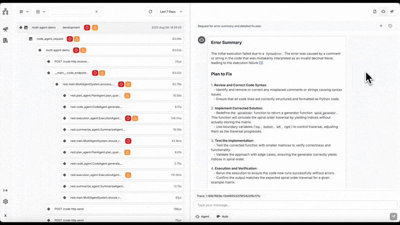

<div align="center">
  <a href="https://traceroot.ai/">
    
  </a>
</div>

<div align="center">

[![Testing Status][testing-image]][testing-url]
[![Documentation][docs-image]][docs-url]
[![Discord][discord-image]][discord-url]
[![PyPI Version][pypi-image]][pypi-url]
[![PyPI SDK Downloads][pypi-sdk-downloads-image]][pypi-sdk-downloads-url]
[![Y Combinator][y-combinator-image]][y-combinator-url]

</div>

**TraceRoot** helps engineers debug production issues **10× faster** using AI-powered analysis of traces, logs, and code context.

- Visit the [TraceRoot website](https://traceroot.ai) to start debugging your production issues.
- Explore the [TraceRoot documentation](https://docs.traceroot.ai) to get started with the TraceRoot library.
- Join our [Discord community](https://discord.gg/tPyffEZvvJ) to learn more and discuss on AI Agent for observability, debugging, tracing and root cause analysis.

## About

TraceRoot accelerates the debugging process with AI-powered insights. It integrates seamlessly into your development workflow, providing real-time trace and log analysis, code context understanding, and intelligent assistance.

## Demo

<div align="center">
  
</div>

## Features

| Feature                                           | Description                                                                   |
| ------------------------------------------------- | ----------------------------------------------------------------------------- |
| 🚀 [Ease of Use](#getting-started-with-traceroot) | Get started with TraceRoot in minutes with our simple setup process           |
| 🤖 LLM Flexibility                                | Bring your own model (OpenAI, Anthropic, local LLMs) for AI-powered debugging |
| 🌐 Distributed Services                           | Cross-platform support with distributed setup for enterprise-scale debugging  |
| 💻 AI Debugging Interface                         | Cursor-like interface specialized for debugging with AI assistance            |
| 🔌 Integration Support                            | Native integration with GitHub, Notion, Slack, and other tools                |

## Getting started with TraceRoot

### TraceRoot Cloud (Recommended)

The fastest and most reliable way to start with TraceRoot is by signing up for free to [TraceRoot Cloud](https://prod1.traceroot.ai/sign-up) for a **7-day trial**.
You’ll get:

- **100k** traces + logs storage with **30-day retention**
- **1M** LLM tokens
- AI agent with chat mode

Usually new features will be available in TraceRoot Cloud first, and then they will be released to the self-hosted version.

### Self-hosting TraceRoot (Advanced)

If you want to self-host TraceRoot, you can deploy a starter instance in one line on Linux with Docker:

```bash
/bin/bash -c "$(curl -fsSL https://raw.githubusercontent.com/traceroot-ai/traceroot/HEAD/bin/deploy-starter)"
```

Open source deployments should scale to a certain point and may not cover all the features, thus we recommend [migrating to TraceRoot Cloud](https://traceroot.ai).

In general the open source version will start the UI at [http://localhost:3000](http://localhost:3000) and the API at [http://localhost:8000](http://localhost:8000).

If you don't want to use Docker, please refer to the [DEVELOPMENT.md](DEVELOPMENT.md) for more details to setup the environment manually.

## Setting up TraceRoot

Whether you're using [TraceRoot Cloud](https://traceroot.ai) or our open source version, it's required to use our SDK:

### Available SDKs

| Language              | Repository                                                               |
| --------------------- | ------------------------------------------------------------------------ |
| Python                | [traceroot-sdk](https://github.com/traceroot-ai/traceroot-sdk)           |

For more details on SDK usage and examples, please check out this [Quickstart](https://docs.traceroot.ai/quickstart).

## AI Agent Framework

Here is an overview for our AI Agent Framework:

## Others

**Contributing** 🤝: If you're interested in contributing, you can check out our guide [here](/CONTRIBUTING.md). All types of help are appreciated :)

**Support** 💬: If you need any type of support, we're typically most responsive on our [Discord channel](https://discord.gg/tPyffEZvvJ), but feel free to email us `founders@traceroot.ai` too!

## Contributors

Thanks to all our contributors for helping make TraceRoot better!

<a href="https://github.com/traceroot-ai/traceroot/graphs/contributors">
  
</a>

[company-website-url]: https://traceroot.ai
[discord-image]: https://img.shields.io/discord/1395844148568920114?logo=discord&labelColor=%235462eb&logoColor=%23f5f5f5&color=%235462eb
[discord-url]: https://discord.gg/tPyffEZvvJ
[docs-image]: https://img.shields.io/badge/docs-traceroot.ai-0dbf43
[docs-url]: https://docs.traceroot.ai
[npm-image]: https://img.shields.io/npm/v/traceroot-sdk-ts?style=flat-square&logo=npm&logoColor=fff
[npm-url]: https://www.npmjs.com/package/traceroot-sdk-ts
[pypi-image]: https://badge.fury.io/py/traceroot.svg
[pypi-sdk-downloads-image]: https://static.pepy.tech/badge/traceroot
[pypi-sdk-downloads-url]: https://pypi.python.org/pypi/traceroot
[pypi-url]: https://pypi.python.org/pypi/traceroot
[testing-image]: https://github.com/traceroot-ai/traceroot/actions/workflows/test.yml/badge.svg
[testing-url]: https://github.com/traceroot-ai/traceroot/actions/workflows/test.yml
[y-combinator-image]: https://img.shields.io/badge/Combinator-S25-orange?logo=ycombinator&labelColor=white
[y-combinator-url]: https://www.ycombinator.com/companies/traceroot-ai


<h1 align="center">
  <b>TraceRoot</b>
</h1>

<p align="center">
  <b>AI-powered observability for LLM applications</b><br>
  Debug production issues fast with intelligent trace analysis
</p>

<p align="center">
  <a href="https://github.com/traceroot-ai/traceroot/blob/main/LICENSE">
    
  </a>
  <a href="https://github.com/traceroot-ai/traceroot/issues">
    
  </a>
  <a href="https://github.com/traceroot-ai/traceroot/commits/main">
    
  </a>
</p>

<p align="center">
  <a href="#getting-started">Getting Started</a> •
  <a href="#features">Features</a> •
  <a href="#architecture">Architecture</a> •
  <a href="CONTRIBUTING.md">Contributing</a>
</p>

---

## What is TraceRoot?

TraceRoot is an observability platform that helps teams **debug LLM applications in production**. Instrument your app with our SDK, and TraceRoot captures traces, analyzes them with AI, and surfaces insights to fix bugs faster.

## Features

- **Trace Ingestion** — Capture LLM calls, agent actions, and tool usage via OpenTelemetry-compatible SDK
- **AI-Powered Analysis** — Automatically detect anomalies and get root cause suggestions
- **Session Replay** — Understand user sessions by stepping through trace timelines
- **Production-Ready** — Built on ClickHouse for high-throughput trace storage

## Getting Started

### Prerequisites

- [Docker](https://docs.docker.com/get-docker/)
- [uv](https://docs.astral.sh/uv/) — Python package manager
- [pnpm](https://pnpm.io/) — Node.js package manager
- [goose](https://github.com/pressly/goose) — Database migrations (`brew install goose`)
- [tmux](https://github.com/tmux/tmux) — Terminal multiplexer (`brew install tmux`)

### Quick Start

```bash
git clone https://github.com/traceroot-ai/traceroot.git
cd traceroot
make dev
```

That's it! This starts all services in a tmux session:

| Service | URL |
|---------|-----|
| **Frontend** | http://localhost:3000 |
| **REST API** | http://localhost:8000/docs |

### Instrument Your App

```bash
pip install traceroot
```

```python
import traceroot
from traceroot import observe

# Initialize once at startup — reads TRACEROOT_API_KEY from env by default
traceroot.initialize()

@observe()
def my_agent():
    # Your LLM calls here
    pass
```

## Self-Hosting

TraceRoot can be self-hosted with Docker Compose:

```bash
# Coming soon
docker compose up
```

Set `ENABLE_BILLING=false` in your `.env` to unlock all features without Stripe integration.

## Contributing

We welcome contributions! See [CONTRIBUTING.md](CONTRIBUTING.md) for:

- Development setup
- Project structure
- Code style guidelines
- How to submit PRs

## License

TraceRoot is [Apache-2.0 licensed](LICENSE).

When contributing, you'll need to agree to our [Contributor License Agreement](https://cla-assistant.io/traceroot-ai/traceroot).
