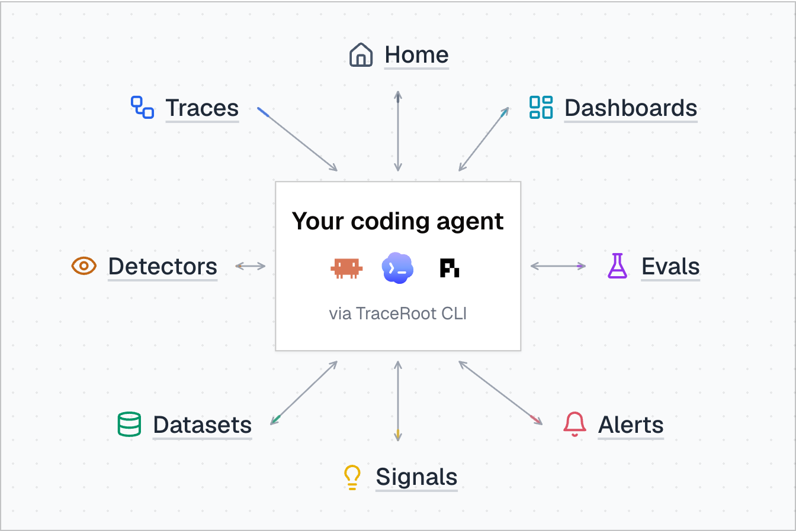
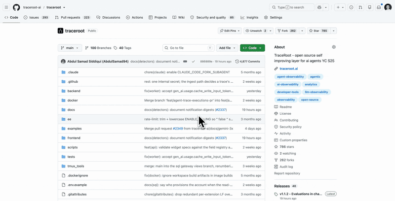

<div align="center">
  <a href="https://traceroot.ai/">
    
  </a>

### Open Source Self-improving Layer for AI Agents

[TraceRoot](https://traceroot.ai/) turns production traces into actionable feedback and evals, closing the self-improving loop with your coding agent.

**[Try Cloud](https://app.traceroot.ai) · [Getting Started](#getting-started) · [CLI](#cli-quickstart) · [Self-Hosting](#self-hosting) · [Docs](https://traceroot.ai/docs)**

  [![Y Combinator][y-combinator-image]][y-combinator-url]
  [![License][license-image]][license-url]
  [![X (Twitter)][twitter-image]][twitter-url]
  [![Discord][discord-image]][discord-url]
  [![Documentation][docs-image]][docs-url]
  [![PyPI SDK Downloads][pypi-sdk-downloads-image]][pypi-sdk-downloads-url]
  [](https://deepwiki.com/traceroot-ai/traceroot)

</div>

<p align="center">
  <a href="./README.md"></a>
  <a href="./README.zh.md"></a>
  <a href="./README.ko.md"></a>
</p>

<p align="center">⭐ Help us reach more developers and grow the TraceRoot community. Star this repo!</p>

## Core Features

### Turn production failures into tested improvements

Use production feedback to decide what to change, then measure whether your next version is better.

| Step | What you do |
| ---- | ----------- |
| **[Trace](https://traceroot.ai/docs/tracing/get-started)** | See model calls, tool calls, and responses with inputs, outputs, latency, and cost. |
| **[Detect](https://traceroot.ai/docs/detectors/get-started)** | Evaluate production traffic for failures and inefficiencies with configurable detectors. |
| **Signals** | Surface recurring patterns across detector findings to identify improvement opportunities. |
| **[Verify](https://traceroot.ai/docs/evals/get-started)** | Compare baseline and candidate runs on versioned datasets to check whether your changes improve results. |

Bring the supporting traces to your coding agent, make a local change, and compare evaluation results before shipping. Repeat as new production feedback arrives.

### Built for your coding agent

Give your coding agent read and write access to TraceRoot through an agent-native CLI. Explore traces, signals, and the home workspace; create and update detectors, datasets, evals, dashboards, and alerts—all from your coding agent.

<p align="center">
  <a href="https://github.com/traceroot-ai/traceroot-cli">
    <picture>
      <source media="(prefers-color-scheme: dark)" srcset="docs/images/coding-agent-cli-dark.png">
      
    </picture>
  </a>
</p>
## ⭐ Star the Repository

If you like what we’re building, give TraceRoot a star ⭐ to help more developers discover it.

<p align="center">
  <a href="https://github.com/traceroot-ai/traceroot">
    
  </a>
</p>

## Getting Started

### 1. Choose where to run TraceRoot

**TraceRoot Cloud:** [Create an account](https://app.traceroot.ai) to get started without running the platform yourself.

#### Self-Hosting

With Git, Docker Compose, and Make installed, run locally:

```bash
git clone https://github.com/traceroot-ai/traceroot.git
cd traceroot
cp .env.example .env
make prod-lite
```

Open [localhost:3000](http://localhost:3000). See the [self-hosting guide](https://traceroot.ai/docs/developer/self-hosting) for configuration and deployment details.

### 2. Send your first trace

Create a project and a project API key in your dashboard, then instrument your application with the **[Python SDK](https://github.com/traceroot-ai/traceroot-py#readme)** or **[TypeScript SDK](https://github.com/traceroot-ai/traceroot-ts#readme)**. Already sending traces? Continue to the CLI setup below.

<details>
<summary>Run a minimal TypeScript example</summary>

You need Node.js and npm, a TraceRoot project API key, and an OpenAI API key. For self-hosting, replace the cloud host URL below with your instance URL.

**1. Install the SDK** in your TypeScript project:

```sh
npm install @traceroot-ai/traceroot openai
```

**2. Set your API keys:**

```bash
export TRACEROOT_API_KEY="your-project-api-key"
export TRACEROOT_HOST_URL="https://app.traceroot.ai"
export OPENAI_API_KEY="your-openai-api-key"
```

**3. Trace an agent call.** Save this as `example.ts`:

```typescript
import OpenAI from 'openai';
import { TraceRoot, observe } from '@traceroot-ai/traceroot';

TraceRoot.initialize({ instrumentModules: { openAI: OpenAI } });
const openai = new OpenAI();

const myAgent = observe({ name: 'my_agent', type: 'agent' }, async (query: string) => {
  const response = await openai.chat.completions.create({
    model: 'gpt-4o',
    messages: [{ role: 'user', content: query }],
  });
  return response.choices[0].message.content;
});

async function main() {
  try {
    await myAgent("What's the weather in SF?");
  } finally {
    await TraceRoot.shutdown();
  }
}

main().catch(console.error);
```

**4. Run it** with `npx tsx example.ts`, then open your project's **Traces** page to inspect the agent run. This example makes one OpenAI API call.

</details>

**Your first result:** open your project's **Traces** page to inspect the inputs, outputs, latency, and cost of the call.

### 3. Connect your coding agent

<a id="cli-quickstart"></a>

With Node.js and npm installed, install the [TraceRoot CLI](https://github.com/traceroot-ai/traceroot-cli#readme) and authenticate. For self-hosting, set `TRACEROOT_HOST_URL` to your instance URL before logging in.

```bash
npm install -g traceroot-cli
traceroot login
traceroot projects list
```

Choose a project from the list and use its ID to inspect recent traces:

```bash
traceroot traces list --project <project-id> --limit 5
```

Then ask your coding agent:

```text
Use the TraceRoot CLI to inspect the latest trace in project <project-id>.
Explain the model and tool calls, identify any failures or unnecessary work,
and link me to the trace in TraceRoot.
```

Replace `<project-id>` with your project ID. The result should be an explanation grounded in your trace, with a link to inspect it in the dashboard.

See the [CLI reference](https://github.com/traceroot-ai/traceroot-cli#readme) for agent skills, authentication options, and read/write commands.

## Integrations

### Native SDKs

| Language | Repository |
| -------- | ---------- |
| Python | [traceroot-py](https://github.com/traceroot-ai/traceroot-py) |
| TypeScript | [traceroot-ts](https://github.com/traceroot-ai/traceroot-ts) |

<details open>
<summary>Supported frameworks and model providers</summary>

### Agent Frameworks

| Integration | Supports | Description |
| ----------- | -------- | ----------- |
| [Agno](https://traceroot.ai/docs/integrations/agno) | Python | Automated instrumentation of agent runs, tool calls, and multi-step reasoning. |
| [AutoGen](https://traceroot.ai/docs/integrations/autogen) | Python | Automated instrumentation of multi-agent conversations, agent loops, and tool calls. |
| [Claude Agent SDK](https://traceroot.ai/docs/integrations/claude-agent-sdk) | Python, JS/TS | Automated instrumentation of agent invocations, subagent delegations, tool calls, and token usage. |
| [CrewAI](https://traceroot.ai/docs/integrations/crewai) | Python | Automated instrumentation of multi-agent collaborative workflows and task executions. |
| [DSPy](https://traceroot.ai/docs/integrations/dspy) | Python | Automated instrumentation of module executions, signature predictions, and underlying LLM calls. |
| [Google ADK](https://traceroot.ai/docs/integrations/google-adk) | Python | Automated instrumentation of agent runs, tool executions, and the multi-turn agent loop. |
| [LangChain & LangGraph](https://traceroot.ai/docs/integrations/langchain) | Python, JS/TS | Automated instrumentation by passing callback handler to LangChain application. |
| [LangChain DeepAgents](https://traceroot.ai/docs/integrations/langchain-deepagents) | Python, JS/TS | Automated instrumentation by passing callback handler to DeepAgents pipeline. |
| [LlamaIndex](https://traceroot.ai/docs/integrations/llamaindex) | Python | Automated instrumentation of RAG pipelines, document ingestion, retrieval, and LLM synthesis. |
| [Microsoft Agent Framework](https://traceroot.ai/docs/integrations/microsoft-agent-framework) | Python | Automated instrumentation of agent runs, model calls, and tool executions via Agent Framework's built-in OpenTelemetry emission. |
| [Mastra](https://traceroot.ai/docs/integrations/mastra) | JS/TS | Automated instrumentation via the TraceRoot OTLP exporter. |
| [OpenAI Agents SDK](https://traceroot.ai/docs/integrations/openai-agents-sdk) | Python, JS/TS | Automated instrumentation of agent runs, tool executions, and handoff transitions. |
| [Pydantic AI](https://traceroot.ai/docs/integrations/pydantic-ai) | Python | Automated instrumentation of agent runs, LLM calls, and tool invocations via pydantic-ai's native OpenTelemetry support. |
| [Vercel AI SDK](https://traceroot.ai/docs/integrations/vercel-ai) | JS/TS | Native OpenTelemetry tracing — no `instrumentModules` config required. AI SDK 7 needs `@ai-sdk/otel`; AI SDK 6 (legacy) uses `experimental_telemetry`. |

### Model Providers

| Integration | Supports | Description |
| ----------- | -------- | ----------- |
| [Anthropic](https://traceroot.ai/docs/integrations/anthropic) | Python, JS/TS | Automated instrumentation of the Messages API. |
| [Google Gemini](https://traceroot.ai/docs/integrations/gemini) | Python | Automated instrumentation via the Google GenAI SDK. |
| [Mistral](https://traceroot.ai/docs/integrations/mistral) | Python | Automated instrumentation of Mistral chat completions, tool calls, and streaming responses. |
| [OpenAI](https://traceroot.ai/docs/integrations/openai) | Python, JS/TS | Automated instrumentation of Chat Completions and Responses API. |
| [OpenRouter](https://traceroot.ai/docs/integrations/openrouter) | Python, JS/TS | OpenAI-compatible tracing via the OpenAI SDK base URL; see the [Python](./examples/python/openrouter-tool-agent) and [TypeScript](./examples/typescript/openrouter) examples. |

</details>

> Don't see your framework or provider? [Request an integration](https://github.com/traceroot-ai/traceroot/issues).

## Security & Privacy

Your data security and privacy are our top priorities. Learn more in our [Security and Privacy](SECURITY.md) documentation.

## Community

Special thanks to [pi-mono](https://github.com/badlogic/pi-mono), which powers our agent runtime.

**Contributing** 🤝: Help with code, documentation, integrations, or runnable examples. Start with the [contribution guide](CONTRIBUTING.md) and [unassigned beginner issues that do not need approval](https://github.com/traceroot-ai/traceroot/issues?q=is%3Aissue%20is%3Aopen%20label%3A%22good%20first%20issue%22%20-label%3A%22needs%20approval%22%20no%3Aassignee).

**Support** 💬: If you need any type of support, we're typically most responsive on our [Discord channel](https://discord.gg/TM2m3CtKuC), but feel free to email us `founders@traceroot.ai` too!

## License

TraceRoot uses [Apache 2.0](LICENSE) for code outside directories named `ee`. Those directories are covered by the [Enterprise License](ee/LICENSE).

## Star History

<p align="center">
<a href="https://star-history.com/#traceroot-ai/traceroot&Date">
 <picture>
   <source media="(prefers-color-scheme: dark)" srcset="https://api.star-history.com/svg?repos=traceroot-ai/traceroot&type=Date&theme=dark" />
   <source media="(prefers-color-scheme: light)" srcset="https://api.star-history.com/svg?repos=traceroot-ai/traceroot&type=Date" />
   
 </picture>
</a>
</p>

## Contributors

<p align="center">
<a href="https://github.com/traceroot-ai/traceroot/graphs/contributors">
  
</a>
</p>

<br>

<p align="center">⭐ <b>Star us on GitHub</b> to support TraceRoot!</p>

<!-- Links -->
[discord-image]: https://img.shields.io/discord/1395844148568920114?logo=discord&labelColor=%235462eb&logoColor=%23f5f5f5&color=%235462eb
[discord-url]: https://discord.gg/TM2m3CtKuC
[license-image]: https://img.shields.io/badge/License-Apache%202.0-blue.svg
[license-url]: https://opensource.org/licenses/Apache-2.0
[docs-image]: https://img.shields.io/badge/docs-traceroot.ai-0dbf43
[docs-url]: https://traceroot.ai/docs
[pypi-sdk-downloads-image]: https://static.pepy.tech/badge/traceroot
[pypi-sdk-downloads-url]: https://pypi.python.org/pypi/traceroot
[y-combinator-image]: https://img.shields.io/badge/Combinator-S25-orange?logo=ycombinator&labelColor=white
[y-combinator-url]: https://www.ycombinator.com/companies/traceroot-ai
[twitter-image]: https://img.shields.io/twitter/follow/TraceRootAI
[twitter-url]: https://x.com/TraceRootAI
