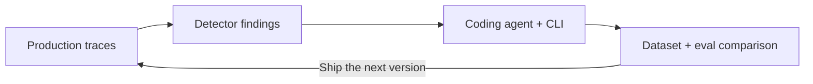

<div align="center">
  <a href="https://traceroot.ai/">
    
  </a>

### Open Source Self-improving Layer for AI Agents

[TraceRoot](https://traceroot.ai/) turns production traces into actionable feedback and evals, closing the self-improving loop with your coding agent.

**[Try Cloud](https://app.traceroot.ai) · [Quickstart](#quickstart) · [CLI](#built-for-coding-agents) · [Self-host](#self-host) · [Docs](https://traceroot.ai/docs)**

  [![Y Combinator][y-combinator-image]][y-combinator-url]
  [![License][license-image]][license-url]
  [![X (Twitter)][twitter-image]][twitter-url]
  [![Discord][discord-image]][discord-url]
  [![Documentation][docs-image]][docs-url]
  [![PyPI SDK Downloads][pypi-sdk-downloads-image]][pypi-sdk-downloads-url]
  [](https://deepwiki.com/traceroot-ai/traceroot)

</div>

<p align="center">
  <a href="./README.md"></a>
  <a href="./README.zh.md"></a>
  <a href="./README.ko.md"></a>
</p>

## From production signals to better agents

Understand what your agent did, find opportunities to improve it, and test the next version with real context.

<p align="center">
  <a href="https://traceroot.ai/docs/detectors/get-started">
    
  </a>
</p>
<p align="center"><em>Detectors surface findings from production traces so you can decide what to improve next.</em></p>

## Star TraceRoot

If you like what we’re building, give TraceRoot a star to help more developers discover it.

<p align="center">
  <a href="https://github.com/traceroot-ai/traceroot">
    
  </a>
</p>

## How it works

1. **Find improvement opportunities.** Capture agent runs and configure detectors to flag behaviors you care about, such as missed tasks or incorrect tool use.
2. **Bring context into development.** Use the CLI to give your coding agent access to traces and findings alongside your code.
3. **Evaluate the next version.** Build representative datasets, run your agent with the Python or TypeScript SDK, and compare results using code scorers or LLM judges.


```mermaid
flowchart LR
    A[Production traces] --> B[Detector findings]
    B --> C[Coding agent + CLI]
    C --> D[Dataset + eval comparison]
    D -->|Ship the next version| A
```

You decide what to change and ship. TraceRoot provides the production context and evaluation tools for the loop.

## Built for coding agents

Give Claude Code, Codex, Pi, or another coding agent a terminal interface to your production context. The CLI supports readable output for you and JSON for tools.

Requires Node.js 20.3 or later and a TraceRoot project with traces. New here? Start with [TraceRoot Cloud](#traceroot-cloud).

```bash
npm install -g traceroot-cli
traceroot login
traceroot projects list
```

Copy a project ID from the list, then inspect its recent activity:

```bash
traceroot traces list --project <project-id> --limit 10
traceroot findings list --project <project-id> --since 24h
traceroot traces get <trace-id> --project <project-id> --fields full --json
```

For example, ask your coding agent:

> Use the TraceRoot CLI to inspect recent findings and the related traces. Explain one improvement opportunity, identify the relevant code, and propose an eval case to test the change.

The CLI also includes [skills and instrumentation helpers](https://github.com/traceroot-ai/traceroot-cli#readme). Run `traceroot skills list` to explore them. An empty findings list simply means there are no matching findings yet; [create a detector](https://traceroot.ai/docs/detectors/get-started) to start evaluating incoming traces.

**[CLI source and command reference →](https://github.com/traceroot-ai/traceroot-cli)**

## Core features

| Capability | What you can do |
| ---------- | --------------- |
| [Tracing](https://traceroot.ai/docs/tracing/get-started) | Capture LLM calls, tool use, and agent steps with OpenTelemetry-compatible Python and TypeScript SDKs. Inspect inputs, outputs, latency, tokens, and cost. |
| [Detectors](https://traceroot.ai/docs/detectors/get-started) | Define behaviors to look for in production traces, configure sampling and judge models, and review findings. |
| [Datasets](https://traceroot.ai/docs/evals/datasets) | Author, version, and publish the cases you want your agent to handle well. |
| [Evaluations](https://traceroot.ai/docs/evals/get-started) | Run your system against a dataset, score each case, and compare candidate versions. Each case is also a trace you can inspect. |
| [CLI](https://github.com/traceroot-ai/traceroot-cli) | Read and export traces, inspect detectors and findings, and bring that context into your coding workflow. |
| Dashboards & alerts | Track quality, latency, and cost, and configure threshold alerts. |
| In-app AI assistant | Explore traces with an agent that can access your source code and GitHub context. Use a hosted model or bring your own key. |

## Quickstart

### Try an eval locally

No TraceRoot account or model API key needed for this deterministic example. Use Python 3.11 or later in a virtual environment:

```bash
pip install "traceroot>=0.2.0"
```

Save this as `eval_example.py`:

```python
from traceroot import Dataset, evaluate

cases = Dataset("Capitals QA", key="capitals-qa")
cases.add({"country": "France"}, expected="Paris")
cases.add({"country": "Japan"}, expected="Tokyo")


def task(input):
    return {"France": "Paris", "Japan": "Tokyo"}.get(input["country"], "")


def matches_expected(input, output, expected=None):
    return output == expected


result = evaluate(
    name="capitals",
    dataset=cases,
    task=task,
    scorers=[matches_expected],
    candidate_version="capitals-v1",
    local=True,
)
print(result.summary())
```

```bash
python eval_example.py
```

Both cases should score as correct. Change one answer and run again to see the score change. This example runs locally and does not upload results.

**Next:** [Report runs to TraceRoot and compare versions](https://traceroot.ai/docs/evals/get-started), or try a complete tool-using agent in [Python](examples/python/agent-eval) or [TypeScript](examples/typescript/agent-eval). Those agent examples require model API keys.

### TraceRoot Cloud

1. [Create an account](https://app.traceroot.ai), create a project, and generate a project API key.
2. Set your credentials in the environment where your agent runs:

   ```bash
   export TRACEROOT_API_KEY="your-project-api-key"
   export TRACEROOT_HOST_URL="https://app.traceroot.ai"
   ```

3. Follow the [Python or TypeScript tracing quickstart](https://traceroot.ai/docs/tracing/get-started), or use an [integration](#integrations) for your framework. Model calls also require your provider's API key.
4. Run your agent and open the project's **Traces** page to inspect the run. Then [create your first detector](https://traceroot.ai/docs/detectors/get-started).

### Self-host

Requires Git, Make, and Docker with Compose v2 running. This command builds the app and starts the local Docker stack:

```bash
git clone https://github.com/traceroot-ai/traceroot.git
cd traceroot
cp .env.example .env
make prod-lite
```

Open [localhost:3000](http://localhost:3000). Review `.env` for your deployment; the local defaults are for local testing. See the [self-hosting guide](https://traceroot.ai/docs/developer/self-hosting) for details.

Want to develop TraceRoot itself? Follow [CONTRIBUTING.md](CONTRIBUTING.md) for the development environment.

## Integrations

### Native SDKs

| Language | Repository |
| -------- | ---------- |
| Python | [traceroot-py](https://github.com/traceroot-ai/traceroot-py) |
| TypeScript | [traceroot-ts](https://github.com/traceroot-ai/traceroot-ts) |

<details open>
<summary>Supported frameworks and model providers</summary>

### Agent Frameworks

| Integration | Supports | Description |
| ----------- | -------- | ----------- |
| [Agno](https://traceroot.ai/docs/integrations/agno) | Python | Automated instrumentation of agent runs, tool calls, and multi-step reasoning. |
| [AutoGen](https://traceroot.ai/docs/integrations/autogen) | Python | Automated instrumentation of multi-agent conversations, agent loops, and tool calls. |
| [Claude Agent SDK](https://traceroot.ai/docs/integrations/claude-agent-sdk) | Python, JS/TS | Automated instrumentation of agent invocations, subagent delegations, tool calls, and token usage. |
| [CrewAI](https://traceroot.ai/docs/integrations/crewai) | Python | Automated instrumentation of multi-agent collaborative workflows and task executions. |
| [DSPy](https://traceroot.ai/docs/integrations/dspy) | Python | Automated instrumentation of module executions, signature predictions, and underlying LLM calls. |
| [Google ADK](https://traceroot.ai/docs/integrations/google-adk) | Python | Automated instrumentation of agent runs, tool executions, and the multi-turn agent loop. |
| [LangChain & LangGraph](https://traceroot.ai/docs/integrations/langchain) | Python, JS/TS | Automated instrumentation by passing callback handler to LangChain application. |
| [LangChain DeepAgents](https://traceroot.ai/docs/integrations/langchain-deepagents) | Python, JS/TS | Automated instrumentation by passing callback handler to DeepAgents pipeline. |
| [LlamaIndex](https://traceroot.ai/docs/integrations/llamaindex) | Python | Automated instrumentation of RAG pipelines, document ingestion, retrieval, and LLM synthesis. |
| [Microsoft Agent Framework](https://traceroot.ai/docs/integrations/microsoft-agent-framework) | Python | Automated instrumentation of agent runs, model calls, and tool executions via Agent Framework's built-in OpenTelemetry emission. |
| [Mastra](https://traceroot.ai/docs/integrations/mastra) | JS/TS | Automated instrumentation via the TraceRoot OTLP exporter. |
| [OpenAI Agents SDK](https://traceroot.ai/docs/integrations/openai-agents-sdk) | Python, JS/TS | Automated instrumentation of agent runs, tool executions, and handoff transitions. |
| [Pydantic AI](https://traceroot.ai/docs/integrations/pydantic-ai) | Python | Automated instrumentation of agent runs, LLM calls, and tool invocations via pydantic-ai's native OpenTelemetry support. |
| [Vercel AI SDK](https://traceroot.ai/docs/integrations/vercel-ai) | JS/TS | Native OpenTelemetry tracing — no `instrumentModules` config required. AI SDK 7 needs `@ai-sdk/otel`; AI SDK 6 (legacy) uses `experimental_telemetry`. |

### Model Providers

| Integration | Supports | Description |
| ----------- | -------- | ----------- |
| [Anthropic](https://traceroot.ai/docs/integrations/anthropic) | Python, JS/TS | Automated instrumentation of the Messages API. |
| [Google Gemini](https://traceroot.ai/docs/integrations/gemini) | Python | Automated instrumentation via the Google GenAI SDK. |
| [Mistral](https://traceroot.ai/docs/integrations/mistral) | Python | Automated instrumentation of Mistral chat completions, tool calls, and streaming responses. |
| [OpenAI](https://traceroot.ai/docs/integrations/openai) | Python, JS/TS | Automated instrumentation of Chat Completions and Responses API. |
| [OpenRouter](https://traceroot.ai/docs/integrations/openrouter) | Python, JS/TS | OpenAI-compatible tracing via the OpenAI SDK base URL; see the [Python](./examples/python/openrouter-tool-agent) and [TypeScript](./examples/typescript/openrouter) examples. |

</details>

> Don't see your framework or provider? [Request an integration](https://github.com/traceroot-ai/traceroot/issues).

## Security & Privacy

Your data security and privacy are our top priorities. Learn more in our [Security and Privacy](SECURITY.md) documentation.

## Community

Special thanks to [pi-mono](https://github.com/badlogic/pi-mono), which powers our agent runtime.

**Contributing** 🤝: Help with code, documentation, integrations, or runnable examples. Start with the [contribution guide](CONTRIBUTING.md) and [unassigned beginner issues that do not need approval](https://github.com/traceroot-ai/traceroot/issues?q=is%3Aissue%20is%3Aopen%20label%3A%22good%20first%20issue%22%20-label%3A%22needs%20approval%22%20no%3Aassignee).

**Support** 💬: If you need any type of support, we're typically most responsive on our [Discord channel](https://discord.gg/TM2m3CtKuC), but feel free to email us `founders@traceroot.ai` too!

## License

TraceRoot uses [Apache 2.0](LICENSE) for code outside directories named `ee`. Those directories are covered by the [Enterprise License](ee/LICENSE).

## Star History

<a href="https://star-history.com/#traceroot-ai/traceroot&Date">
 <picture>
   <source media="(prefers-color-scheme: dark)" srcset="https://api.star-history.com/svg?repos=traceroot-ai/traceroot&type=Date&theme=dark" />
   <source media="(prefers-color-scheme: light)" srcset="https://api.star-history.com/svg?repos=traceroot-ai/traceroot&type=Date" />
   
 </picture>
</a>

## Contributors

<a href="https://github.com/traceroot-ai/traceroot/graphs/contributors">
  
</a>

<!-- Links -->
[discord-image]: https://img.shields.io/discord/1395844148568920114?logo=discord&labelColor=%235462eb&logoColor=%23f5f5f5&color=%235462eb
[discord-url]: https://discord.gg/TM2m3CtKuC
[license-image]: https://img.shields.io/badge/License-Apache%202.0-blue.svg
[license-url]: https://opensource.org/licenses/Apache-2.0
[docs-image]: https://img.shields.io/badge/docs-traceroot.ai-0dbf43
[docs-url]: https://traceroot.ai/docs
[pypi-sdk-downloads-image]: https://static.pepy.tech/badge/traceroot
[pypi-sdk-downloads-url]: https://pypi.python.org/pypi/traceroot
[y-combinator-image]: https://img.shields.io/badge/Combinator-S25-orange?logo=ycombinator&labelColor=white
[y-combinator-url]: https://www.ycombinator.com/companies/traceroot-ai
[twitter-image]: https://img.shields.io/twitter/follow/TraceRootAI
[twitter-url]: https://x.com/TraceRootAI
