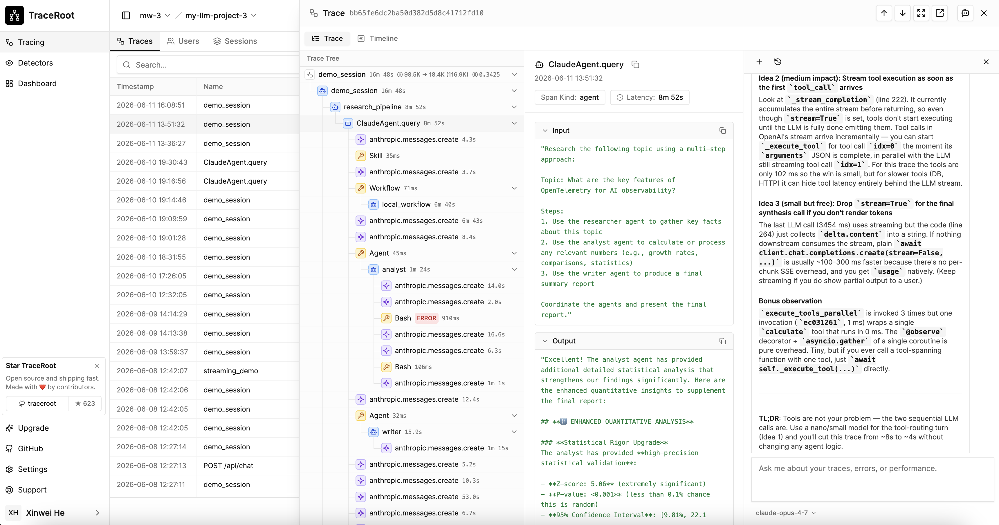

<div align="center">
  <a href="https://traceroot.ai/">
    
  </a>

[TraceRoot]("https://traceroot.ai/") 是面向 AI Agent 的开源可观测性平台 —— 捕获调用链路，监控生产环境问题，并通过能够理解你的源码与 GitHub 上下文的 AI 快速定位并修复问题。

  [![Y Combinator][y-combinator-image]][y-combinator-url]
  [![License][license-image]][license-url]
  [![X (Twitter)][twitter-image]][twitter-url]
  [![Discord][discord-image]][discord-url]
  [![Documentation][docs-image]][docs-url]
  [![PyPI SDK Downloads][pypi-sdk-downloads-image]][pypi-sdk-downloads-url]
  [](https://deepwiki.com/traceroot-ai/traceroot)

</div>

<p align="center">
  <a href="./README.md"></a>
  <a href="./README.zh.md"></a>
  <a href="./README.ko.md"></a>
</p>

## 功能特性

<div align="center">
  <kbd></kbd>
</div>

<br>

| 功能 | 描述 |
| ---- | ---- |
| 检测器（Detectors） | 由 LLM 充当评审，监控进入的追踪是否存在幻觉、工具/逻辑错误、安全违规以及意图漂移 —— 自动呈现发现项，并触发根因分析与邮件、Slack 告警。 |
| 智能调试（Agentic Debugging） | AI 可以看到你的所有追踪，连接到运行你生产源码的沙箱中，精确定位出错的代码行，并将故障与你的 GitHub commit、PR、issue 关联起来。支持 BYOK，可接入任意模型厂商。 |
| 追踪（Tracing） | 通过兼容 OpenTelemetry 的 SDK 采集 LLM 调用、Agent 行为以及工具使用情况。智能浮现真正值得关注的追踪 —— 过滤噪声，优先呈现信号。 |

## 为什么选择 TraceRoot？

- **仅靠追踪数据无法扩展。**

  随着 AI Agent 系统越来越复杂，手动逐条翻看追踪已经不可持续。TraceRoot 的检测器会有选择地筛查进入的追踪 —— 自动标记幻觉、工具失败、逻辑错误以及安全问题，让你把时间花在解决问题上，而不是寻找问题上。

- **调试 AI Agent 系统非常痛苦。**

  Agent 幻觉、工具调用不稳定、版本变更带来的故障，根因定位都非常困难。TraceRoot 的 AI 会连接到运行你生产源码的沙箱，准确指出出错的代码行，交叉比对你的 GitHub 历史 —— commit、PR、开启中的 issue，并自动创建 PR 来修复问题。

- **完全开源，无厂商锁定。**

  可观测性平台与 AI 调试层都是开源的。支持 BYOK，可接入任意模型厂商 —— OpenAI、Anthropic、Gemini、xAI、DeepSeek、OpenRouter、Kimi、GLM 等等。

## 文档

完整文档请见 [traceroot.ai/docs](https://traceroot.ai/docs)。

## 快速开始

### TraceRoot Cloud

最快的上手方式。提供充足的存储和 LLM token 用于测试，无需信用卡。点击[这里](https://app.traceroot.ai)注册！

### 自托管

- 开发者模式：在本地运行 TraceRoot 以参与贡献。

  ```bash
  # 拉取最新仓库
  git clone https://github.com/traceroot-ai/traceroot.git
  cd traceroot

  # 基础设施用 Docker 托管，应用本地运行
  make dev
  ```
  更多细节请见 [CONTRIBUTING.md](CONTRIBUTING.md)。

- 本地 Docker 模式：在本地完整运行 TraceRoot 以进行测试。

  ```bash
  # 拉取最新仓库
  git clone https://github.com/traceroot-ai/traceroot.git
  cd traceroot

  # 全部组件都跑在 Docker 中
  make prod
  ```

- [Terraform (AWS)](./deploy/)：通过 Helm 和 Terraform 在 k8s 上运行 TraceRoot。该方式面向生产环境部署，目前仍处于实验阶段。

## 集成

### 模型厂商

| 集成 | 支持语言 | 描述 |
| ---- | -------- | ---- |
| [OpenAI](https://traceroot.ai/docs/integrations/openai) | Python, JS/TS | 自动埋点 Chat Completions 与 Responses API。 |
| [OpenRouter](https://traceroot.ai/docs/integrations/openrouter) | Python, JS/TS | 通过 OpenAI SDK 的 OpenRouter base URL 进行兼容追踪；可参考 [Python](./examples/python/openrouter-tool-agent) 与 [TypeScript](./examples/typescript/openrouter) 示例。 |
| [Anthropic](https://traceroot.ai/docs/integrations/anthropic) | Python, JS/TS | 自动埋点 Messages API。 |
| [Google Gemini](https://traceroot.ai/docs/integrations/gemini) | Python | 通过 Google GenAI SDK 实现自动埋点。 |
| [Mistral](https://traceroot.ai/docs/integrations/mistral) | Python | 自动埋点 Mistral 的 chat completions、工具调用以及流式响应。 |
| [Groq](https://traceroot.ai/docs/integrations/groq) | Python, JS/TS | Python 中原生埋点 Groq SDK；JS/TS 中通过 Groq 的 base URL 以 OpenAI 兼容方式追踪。可参考 [Python](./examples/python/groq-tool-agent) 与 [TypeScript](./examples/typescript/groq) 示例。 |

### Agent 框架

| 集成 | 支持语言 | 描述 |
| ---- | -------- | ---- |
| [LangChain & LangGraph](https://traceroot.ai/docs/integrations/langchain) | Python, JS/TS | 将 callback handler 传入 LangChain 应用即可自动埋点。 |
| [LangChain DeepAgents](https://traceroot.ai/docs/integrations/langchain-deepagents) | Python, JS/TS | 将 callback handler 传入 DeepAgents 流水线即可自动埋点。 |
| [Claude Agent SDK](https://traceroot.ai/docs/integrations/claude-agent-sdk) | Python, JS/TS | 自动埋点 Agent 调用、子 Agent 委派、工具调用以及 token 用量。 |
| [OpenAI Agents SDK](https://traceroot.ai/docs/integrations/openai-agents-sdk) | Python, JS/TS | 自动埋点 Agent 运行、工具执行以及 handoff 流转。 |
| [Mastra](https://traceroot.ai/docs/integrations/mastra) | JS/TS | 通过 TraceRoot OTLP exporter 自动埋点。 |
| [Vercel AI SDK](https://traceroot.ai/docs/integrations/vercel-ai) | JS/TS | 通过 `experimental_telemetry` 原生 OpenTelemetry 追踪，无需配置 `instrumentModules`。 |
| [AutoGen](https://traceroot.ai/docs/integrations/autogen) | Python | 自动埋点多 Agent 对话、Agent 循环以及工具调用。 |
| [LlamaIndex](https://traceroot.ai/docs/integrations/llamaindex) | Python | 自动埋点 RAG 流水线、文档摄取、检索以及 LLM 综合生成。 |
| [Microsoft Agent Framework](https://traceroot.ai/docs/integrations/microsoft-agent-framework) | Python | 通过 Agent Framework 内置的 OpenTelemetry 自动埋点 Agent 运行、模型调用以及工具执行。 |
| [CrewAI](https://traceroot.ai/docs/integrations/crewai) | Python | 自动埋点多 Agent 协作流程以及任务执行。 |
| [Agno](https://traceroot.ai/docs/integrations/agno) | Python | 自动埋点 Agent 运行、工具调用以及多步推理。 |
| [DSPy](https://traceroot.ai/docs/integrations/dspy) | Python | 自动埋点模块执行、signature 预测以及底层 LLM 调用。 |
| [Google ADK](https://traceroot.ai/docs/integrations/google-adk) | Python | 自动埋点 Agent 运行、工具执行以及多轮 Agent 循环。 |
| [Pydantic AI](https://traceroot.ai/docs/integrations/pydantic-ai) | Python | 通过 pydantic-ai 原生 OpenTelemetry 支持，自动埋点 Agent 运行、LLM 调用以及工具调用。 |

> 没有看到你使用的框架或模型厂商？欢迎[提交集成请求](https://github.com/traceroot-ai/traceroot/issues)。

## SDK

| 语言 | 仓库 |
| ---- | ---- |
| Python | [traceroot-py](https://github.com/traceroot-ai/traceroot-py) |
| TypeScript | [traceroot-ts](https://github.com/traceroot-ai/traceroot-ts) |

## Python SDK 快速上手

```bash
pip install traceroot openai
```

```python
import traceroot
from traceroot import Integration, observe
from openai import OpenAI

traceroot.initialize(integrations=[Integration.OPENAI])
client = OpenAI()

@observe(name="my_agent", type="agent")
def my_agent(query: str) -> str:
    response = client.chat.completions.create(
        model="gpt-4o",
        messages=[{"role": "user", "content": query}],
    )
    return response.choices[0].message.content

if __name__ == "__main__":
    my_agent("What's the weather in SF?")
```

## TypeScript SDK 快速上手

```sh
npm install @traceroot-ai/traceroot openai
```

```typescript
import OpenAI from 'openai';
import { TraceRoot, observe } from '@traceroot-ai/traceroot';

TraceRoot.initialize({ instrumentModules: { openAI: OpenAI } });
const openai = new OpenAI();

const myAgent = observe({ name: 'my_agent', type: 'agent' }, async (query: string) => {
  const response = await openai.chat.completions.create({
    model: 'gpt-4o',
    messages: [{ role: 'user', content: query }],
  });
  return response.choices[0].message.content;
});

async function main() {
  try {
    await myAgent("What's the weather in SF?");
  } finally {
    await TraceRoot.shutdown();
  }
}

main().catch(console.error);
```

## 安全与隐私

我们高度重视用户的数据安全与隐私。详情请见我们的[安全与隐私](SECURITY.md)文档。

## 社区

特别感谢 [pi-mono](https://github.com/badlogic/pi-mono) 项目，它是我们 Agent 调试运行时的基础！

**参与贡献** 🤝：如果你想参与贡献，可以查看我们的[贡献指南](/CONTRIBUTING.md)。任何形式的帮助我们都非常欢迎 :)

**寻求支持** 💬：如果你需要任何形式的支持，我们在 [Discord 频道](https://discord.gg/TM2m3CtKuC) 通常响应最快，也欢迎给我们发邮件 `founders@traceroot.ai`！

## 许可证

本项目基于 [Apache 2.0](LICENSE) 许可证，并包含额外的[企业版功能](./ee/LICENSE)。

## Star 趋势

<a href="https://star-history.com/#traceroot-ai/traceroot&Date">
 <picture>
   <source media="(prefers-color-scheme: dark)" srcset="https://api.star-history.com/svg?repos=traceroot-ai/traceroot&type=Date&theme=dark" />
   <source media="(prefers-color-scheme: light)" srcset="https://api.star-history.com/svg?repos=traceroot-ai/traceroot&type=Date" />
   
 </picture>
</a>

## 贡献者

<a href="https://github.com/traceroot-ai/traceroot/graphs/contributors">
  
</a>

<!-- Links -->
[discord-image]: https://img.shields.io/discord/1395844148568920114?logo=discord&labelColor=%235462eb&logoColor=%23f5f5f5&color=%235462eb
[discord-url]: https://discord.gg/TM2m3CtKuC
[license-image]: https://img.shields.io/badge/License-Apache%202.0-blue.svg
[license-url]: https://opensource.org/licenses/Apache-2.0
[docs-image]: https://img.shields.io/badge/docs-traceroot.ai-0dbf43
[docs-url]: https://traceroot.ai/docs
[pypi-sdk-downloads-image]: https://static.pepy.tech/badge/traceroot
[pypi-sdk-downloads-url]: https://pypi.python.org/pypi/traceroot
[y-combinator-image]: https://img.shields.io/badge/Combinator-S25-orange?logo=ycombinator&labelColor=white
[y-combinator-url]: https://www.ycombinator.com/companies/traceroot-ai
[twitter-image]: https://img.shields.io/twitter/follow/TraceRootAI
[twitter-url]: https://x.com/TraceRootAI
