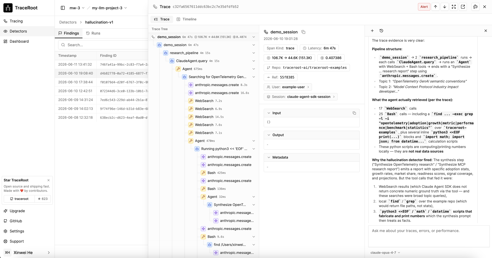

<div align="center">
  <a href="https://traceroot.ai/">
    
  </a>

### 面向 AI Agent 的开源自我改进层

[TraceRoot](https://traceroot.ai/) 将生产环境中的追踪转化为可执行的反馈与评测，与你的编程 Agent 一起形成自我改进闭环。

**[体验云服务](https://app.traceroot.ai) · [快速开始](#快速开始) · [CLI](#cli-快速上手) · [自托管](#自托管) · [文档](https://traceroot.ai/docs)**

  [![Y Combinator][y-combinator-image]][y-combinator-url]
  [![License][license-image]][license-url]
  [![X (Twitter)][twitter-image]][twitter-url]
  [![Discord][discord-image]][discord-url]
  [![Documentation][docs-image]][docs-url]
  [![PyPI SDK Downloads][pypi-sdk-downloads-image]][pypi-sdk-downloads-url]
  [](https://deepwiki.com/traceroot-ai/traceroot)

</div>

<p align="center">
  <a href="./README.md"></a>
  <a href="./README.zh.md"></a>
  <a href="./README.ko.md"></a>
</p>

## 功能

<p align="center">
  <a href="https://traceroot.ai/docs/detectors/get-started">
    
  </a>
</p>
<p align="center"><em>检测器从生产环境中的追踪中发现问题，帮助你确定下一步的改进方向。</em></p>

| 功能 | 描述 |
| ---------- | --------------- |
| [追踪](https://traceroot.ai/docs/tracing/get-started) | 通过兼容 OpenTelemetry 的 Python 和 TypeScript SDK 采集 LLM 调用、工具使用和 Agent 执行步骤，查看输入、输出、延迟、token 用量和成本。 |
| [检测器](https://traceroot.ai/docs/detectors/get-started) | 定义要在生产追踪中检测的行为，配置采样和评审模型，并查看发现项。 |
| [数据集](https://traceroot.ai/docs/evals/datasets) | 编写、管理版本并发布你希望 Agent 能够妥善处理的测试用例。 |
| [评测](https://traceroot.ai/docs/evals/get-started) | 基于数据集运行系统，为每个用例评分并比较候选版本。每个用例也会生成可供查看的追踪。 |
| [CLI](https://github.com/traceroot-ai/traceroot-cli) | 读取和导出追踪，查看检测器和发现项，并将这些上下文带入编程工作流。 |
| 仪表盘与告警 | 监控质量、延迟和成本，并配置阈值告警。 |
| 应用内 AI 助手 | 借助可访问源码与 GitHub 上下文的 Agent 探索追踪。可使用托管模型或自带 API 密钥。 |

## 为什么选择 TraceRoot？

- **仅靠追踪数据无法扩展。**

  随着 AI Agent 系统越来越复杂，手动逐条翻看追踪已经不可持续。TraceRoot 的检测器会有选择地筛查进入的追踪 —— 自动标记幻觉、工具失败、逻辑错误以及安全问题，让你把时间花在解决问题上，而不是寻找问题上。

- **在生产环境中调试 AI Agent 系统非常痛苦。**

  Agent 幻觉、工具调用不稳定、版本变更带来的故障，根因定位都非常困难。TraceRoot 的 AI 会连接到运行你生产源码的沙箱，准确指出出错的代码行，交叉比对你的 GitHub 历史 —— commit、PR、开启中的 issue，并自动创建 PR 来修复问题。

- **Agent 的改进应当是系统性的，而不是临时起意的。**

  大多数团队排查完生产问题就翻篇了 —— 经验教训随之蒸发。TraceRoot 将在线与离线评测连成一个闭环：检测器持续评估线上流量，确认的故障沉淀为黄金数据集，离线评测再据此验证每一次修复。一个版本接一个版本，你的 Agent 变得可度量地更健壮、性能更好 —— 改进成为可重复的流程，而不是一次性的救火。

- **完全开源，无厂商锁定。**

  可观测性平台与 AI 调试层都是开源的。支持 BYOK，可接入任意模型厂商 —— OpenAI、Anthropic、Gemini、xAI、DeepSeek、OpenRouter、Kimi、GLM 等等。

## 为 TraceRoot 点亮 Star

如果你喜欢我们正在构建的产品，欢迎给 TraceRoot 点个 Star ⭐，帮助更多开发者发现它。

<p align="center">
  <a href="https://github.com/traceroot-ai/traceroot">
    
  </a>
</p>

## 快速开始

### TraceRoot Cloud

最快的上手方式。[注册 TraceRoot Cloud](https://app.traceroot.ai)！

### 自托管

使用 Docker 在本地运行：

```bash
git clone https://github.com/traceroot-ai/traceroot.git
cd traceroot
cp .env.example .env
make prod-lite
```

打开 [localhost:3000](http://localhost:3000)。详情请见[自托管指南](https://traceroot.ai/docs/developer/self-hosting)。

## CLI 快速上手

将 [TraceRoot CLI](https://github.com/traceroot-ai/traceroot-cli#readme) 与你的编程 Agent 配合使用。

```bash
npm install -g traceroot-cli
traceroot login
```

## 集成

### 原生 SDK

| 语言 | 仓库 |
| -------- | ---------- |
| Python | [traceroot-py](https://github.com/traceroot-ai/traceroot-py) |
| TypeScript | [traceroot-ts](https://github.com/traceroot-ai/traceroot-ts) |

<details open>
<summary>支持的框架与模型厂商</summary>

### Agent 框架

| 集成 | 支持语言 | 描述 |
| ----------- | -------- | ----------- |
| [Agno](https://traceroot.ai/docs/integrations/agno) | Python | 自动埋点 Agent 运行、工具调用以及多步推理。 |
| [AutoGen](https://traceroot.ai/docs/integrations/autogen) | Python | 自动埋点多 Agent 对话、Agent 循环以及工具调用。 |
| [Claude Agent SDK](https://traceroot.ai/docs/integrations/claude-agent-sdk) | Python, JS/TS | 自动埋点 Agent 调用、子 Agent 委派、工具调用以及 token 用量。 |
| [CrewAI](https://traceroot.ai/docs/integrations/crewai) | Python | 自动埋点多 Agent 协作流程以及任务执行。 |
| [DSPy](https://traceroot.ai/docs/integrations/dspy) | Python | 自动埋点模块执行、signature 预测以及底层 LLM 调用。 |
| [Google ADK](https://traceroot.ai/docs/integrations/google-adk) | Python | 自动埋点 Agent 运行、工具执行以及多轮 Agent 循环。 |
| [LangChain & LangGraph](https://traceroot.ai/docs/integrations/langchain) | Python, JS/TS | 将 callback handler 传入 LangChain 应用即可自动埋点。 |
| [LangChain DeepAgents](https://traceroot.ai/docs/integrations/langchain-deepagents) | Python, JS/TS | 将 callback handler 传入 DeepAgents 流水线即可自动埋点。 |
| [LlamaIndex](https://traceroot.ai/docs/integrations/llamaindex) | Python | 自动埋点 RAG 流水线、文档摄取、检索以及 LLM 综合生成。 |
| [Microsoft Agent Framework](https://traceroot.ai/docs/integrations/microsoft-agent-framework) | Python | 通过 Agent Framework 内置的 OpenTelemetry 自动埋点 Agent 运行、模型调用以及工具执行。 |
| [Mastra](https://traceroot.ai/docs/integrations/mastra) | JS/TS | 通过 TraceRoot OTLP exporter 自动埋点。 |
| [OpenAI Agents SDK](https://traceroot.ai/docs/integrations/openai-agents-sdk) | Python, JS/TS | 自动埋点 Agent 运行、工具执行以及 handoff 流转。 |
| [Pydantic AI](https://traceroot.ai/docs/integrations/pydantic-ai) | Python | 通过 pydantic-ai 原生 OpenTelemetry 支持，自动埋点 Agent 运行、LLM 调用以及工具调用。 |
| [Vercel AI SDK](https://traceroot.ai/docs/integrations/vercel-ai) | JS/TS | 原生 OpenTelemetry 追踪，无需配置 `instrumentModules`。AI SDK 7 需要 `@ai-sdk/otel`，AI SDK 6（旧版）使用 `experimental_telemetry`。 |

### 模型厂商

| 集成 | 支持语言 | 描述 |
| ----------- | -------- | ----------- |
| [Anthropic](https://traceroot.ai/docs/integrations/anthropic) | Python, JS/TS | 自动埋点 Messages API。 |
| [Google Gemini](https://traceroot.ai/docs/integrations/gemini) | Python | 通过 Google GenAI SDK 实现自动埋点。 |
| [Mistral](https://traceroot.ai/docs/integrations/mistral) | Python | 自动埋点 Mistral 的 chat completions、工具调用以及流式响应。 |
| [OpenAI](https://traceroot.ai/docs/integrations/openai) | Python, JS/TS | 自动埋点 Chat Completions 与 Responses API。 |
| [OpenRouter](https://traceroot.ai/docs/integrations/openrouter) | Python, JS/TS | 通过 OpenAI SDK 的 OpenRouter base URL 进行兼容追踪；可参考 [Python](./examples/python/openrouter-tool-agent) 与 [TypeScript](./examples/typescript/openrouter) 示例。 |

</details>

> 没有看到你使用的框架或模型厂商？欢迎[提交集成请求](https://github.com/traceroot-ai/traceroot/issues)。

## TypeScript SDK 快速上手

**1. 在 TypeScript 项目中安装 SDK：**

```sh
npm install @traceroot-ai/traceroot openai
```

**2. 设置 API 密钥：**

```bash
export TRACEROOT_API_KEY="your-project-api-key"
export TRACEROOT_HOST_URL="https://app.traceroot.ai"
export OPENAI_API_KEY="your-openai-api-key"
```

**3. 追踪一次 Agent 调用。** 将以下代码保存为 `example.ts`：

```typescript
import OpenAI from 'openai';
import { TraceRoot, observe } from '@traceroot-ai/traceroot';

TraceRoot.initialize({ instrumentModules: { openAI: OpenAI } });
const openai = new OpenAI();

const myAgent = observe({ name: 'my_agent', type: 'agent' }, async (query: string) => {
  const response = await openai.chat.completions.create({
    model: 'gpt-4o',
    messages: [{ role: 'user', content: query }],
  });
  return response.choices[0].message.content;
});

async function main() {
  try {
    await myAgent("What's the weather in SF?");
  } finally {
    await TraceRoot.shutdown();
  }
}

main().catch(console.error);
```

**4. 运行** `npx tsx example.ts`，然后打开项目的 **Traces** 页面查看 Agent 的运行记录。此示例会调用一次 OpenAI API。

## 安全与隐私

我们高度重视用户的数据安全与隐私。详情请见我们的[安全与隐私](SECURITY.md)文档。

## 社区

特别感谢 [pi-mono](https://github.com/badlogic/pi-mono)，它为我们的 Agent 运行时提供支持。

**参与贡献** 🤝：欢迎贡献代码、文档、集成或可运行的示例。从[贡献指南](CONTRIBUTING.md)和[尚未分配且无需审批的新手任务](https://github.com/traceroot-ai/traceroot/issues?q=is%3Aissue%20is%3Aopen%20label%3A%22good%20first%20issue%22%20-label%3A%22needs%20approval%22%20no%3Aassignee)开始。

**寻求支持** 💬：如果你需要任何形式的支持，我们在 [Discord 频道](https://discord.gg/TM2m3CtKuC) 通常响应最快，也欢迎给我们发邮件 `founders@traceroot.ai`！

## 许可证

TraceRoot 中除名为 `ee` 的目录外，代码均采用 [Apache 2.0](LICENSE) 许可证。`ee` 目录中的代码采用[企业版许可证](ee/LICENSE)。

## Star 趋势

<p align="center">
<a href="https://star-history.com/#traceroot-ai/traceroot&Date">
 <picture>
   <source media="(prefers-color-scheme: dark)" srcset="https://api.star-history.com/svg?repos=traceroot-ai/traceroot&type=Date&theme=dark" />
   <source media="(prefers-color-scheme: light)" srcset="https://api.star-history.com/svg?repos=traceroot-ai/traceroot&type=Date" />
   
 </picture>
</a>
</p>

## 贡献者

<p align="center">
<a href="https://github.com/traceroot-ai/traceroot/graphs/contributors">
  
</a>
</p>

<br>

<p align="center">⭐ <b>在 GitHub 上给我们点个 Star</b>，支持 TraceRoot！</p>

<!-- Links -->
[discord-image]: https://img.shields.io/discord/1395844148568920114?logo=discord&labelColor=%235462eb&logoColor=%23f5f5f5&color=%235462eb
[discord-url]: https://discord.gg/TM2m3CtKuC
[license-image]: https://img.shields.io/badge/License-Apache%202.0-blue.svg
[license-url]: https://opensource.org/licenses/Apache-2.0
[docs-image]: https://img.shields.io/badge/docs-traceroot.ai-0dbf43
[docs-url]: https://traceroot.ai/docs
[pypi-sdk-downloads-image]: https://static.pepy.tech/badge/traceroot
[pypi-sdk-downloads-url]: https://pypi.python.org/pypi/traceroot
[y-combinator-image]: https://img.shields.io/badge/Combinator-S25-orange?logo=ycombinator&labelColor=white
[y-combinator-url]: https://www.ycombinator.com/companies/traceroot-ai
[twitter-image]: https://img.shields.io/twitter/follow/TraceRootAI
[twitter-url]: https://x.com/TraceRootAI
