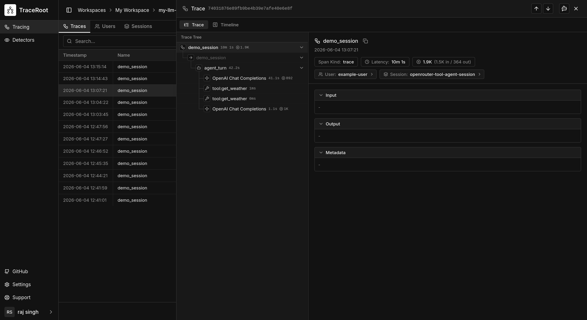

# OpenRouter Agent (TypeScript)

ReAct-style agent with [OpenRouter](https://openrouter.ai/) tool use, instrumented with [TraceRoot](https://traceroot.ai).

OpenRouter provides a unified API to 200+ models (Claude, Llama, Gemini, Mistral, GPT-4o, etc.). Since it's OpenAI-compatible, TraceRoot's OpenAI integration captures all calls automatically — no extra configuration needed.

## Setup

```bash
cp .env.example .env  # fill in OPENROUTER_API_KEY and TRACEROOT_API_KEY
npm install
npm start
```

## What it does

Runs two demo queries that exercise tool use:
1. Weather comparison (San Francisco vs Tokyo)
2. Stock price lookup + calculation (NVDA +10%)

Tools: `get_weather`, `get_stock_price`, `calculate`, `get_current_time`

## Model selection

Change the model by passing a different OpenRouter model string to `new ReActAgent()`:

```typescript
const agent = new ReActAgent("nvidia/nemotron-3-nano-omni-30b-a3b-reasoning:free");
const agent = new ReActAgent("anthropic/claude-sonnet-4");
const agent = new ReActAgent("meta-llama/llama-4-maverick");
```

See [openrouter.ai/models](https://openrouter.ai/models) for the full list.

## TraceRoot UI

After running the example, open [app.traceroot.ai](https://app.traceroot.ai) to view the captured trace. You'll see the full agent span, nested LLM calls, and individual tool invocations with their inputs and outputs.


